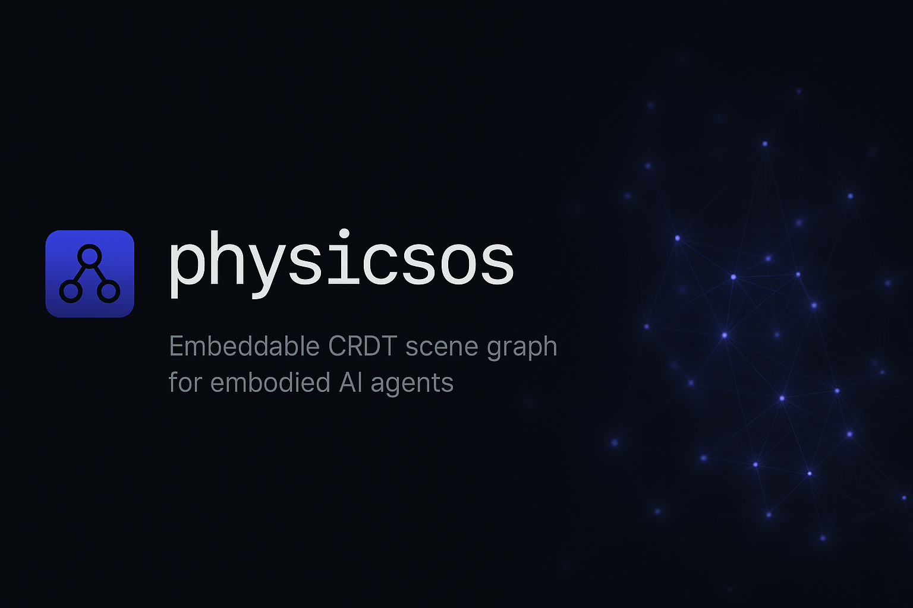
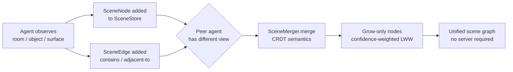

# polaroid

**Embeddable CRDT scene graph for embodied AI agents.**



[](https://github.com/sandeep-alluru/polaroid/actions/workflows/ci.yml)
[](https://pypi.org/project/polaroid-ai/)
[](https://pypi.org/project/polaroid-ai/)
[](https://pypi.org/project/polaroid-ai/)
[](LICENSE)
[](https://codecov.io/gh/sandeep-alluru/polaroid)
[](https://mypy-lang.org/)

[Quick Start](#quick-start) · [How It Works](#how-it-works) · [CLI Reference](#cli-reference) · [GitHub Action](#github-action) · [vs. Alternatives](#vs-alternatives) · [Contributing](CONTRIBUTING.md)

---

## Why

Multiple robots navigating the same building each build their own private map. When robot A opens a door and robot B hasn't been told, they diverge. Sharing a map requires a central server — which is a single point of failure.

polaroid solves this with a **CRDT scene graph**: a persistent, mergeable map of nodes (objects, rooms, surfaces) and edges (spatial relationships). Two robots can merge their maps without a server, without conflicts, without data loss. CRDT semantics guarantee the merge is always safe, deterministic, and idempotent.

```bash
# Share your scene graph with a peer
polaroid merge /path/to/peer/scene.db
```

---

## How It Works



**Core primitives:**

- **SceneNode** — a content-addressed node (object, room, surface, region, or agent). ID = SHA-256[:16] of `label|node_type`. Same label and type always produce the same ID regardless of agent.
- **SceneEdge** — a directed spatial relationship between two nodes (`contains`, `adjacent-to`, `on-top-of`, `blocks`, `connects`). ID = SHA-256[:16] of `source_id|target_id|relation`.
- **SceneStore** — SQLite-backed persistent store. Zero dependencies beyond Python stdlib + click/rich.
- **SceneMerger** — CRDT merge: nodes are grow-only (never deleted), conflicting property updates resolved by confidence-weighted last-write-wins.
- **SceneQuery** — query by type, label substring, confidence, or spatial neighbors.

---

## Features

| Feature | Details |
|---------|---------|
| Content-addressed nodes | Same label+type always produces the same ID — no duplicates |
| CRDT merge semantics | Grow-only sets + confidence-weighted LWW registers |
| Conflict-free merge | `merge()` is idempotent, commutative, and associative |
| Spatial queries | Find nodes by type, label, or neighbors via edge traversal |
| Context summary | One-call text description of the scene for LLM prompts |
| Offline / local-first | Single SQLite file, no server required |
| FastAPI REST server | `/node`, `/edge`, `/nodes`, `/merge`, `/context` endpoints |
| MCP server | Model Context Protocol integration for Claude and other agents |
| 202 tests | Comprehensive test suite covering all layers |

---

## Quick Start

```bash
pip install polaroid-ai
```

```python
from polaroid import SceneNode, SceneEdge, SceneMerger, SceneQuery, SceneStore

# Robot A observes a kitchen
store_a = SceneStore("/tmp/robot-a.db")
kitchen = SceneNode(label="room-kitchen", node_type="room", properties={"floor": "tile"})
table = SceneNode(label="table-A", node_type="object", properties={"color": "brown"}, confidence=0.9)
store_a.upsert_node(kitchen)
store_a.upsert_node(table)

edge = SceneEdge(source_id=kitchen.id, target_id=table.id, relation="contains")
store_a.upsert_edge(edge)

# Robot B observes the same room with a door
store_b = SceneStore("/tmp/robot-b.db")
store_b.upsert_node(kitchen)  # same ID — no duplicate
door = SceneNode(label="door-1", node_type="object", properties={"state": "open"})
store_b.upsert_node(door)

# Merge B into A — CRDT guarantees safety
result = SceneMerger().merge(store_a, store_b)
print(result.summary())
# Added 1 nodes, updated 0 nodes, added 0 edges, resolved 0 conflict(s).

# Query the unified scene
q = SceneQuery(store_a)
print(q.context_summary())
# 1 rooms, 2 objects. Known objects: table-A, door-1. 1 spatial relationship recorded.

store_a.close()
store_b.close()
```

---

## CLI Reference

```bash
polaroid [--db PATH] COMMAND [OPTIONS]
```

| Command | Description | Key options |
|---------|-------------|-------------|
| `add-node LABEL TYPE` | Add a node to the scene | `--confidence FLOAT`, `--property K=V`, `--agent-id STR` |
| `add-edge SOURCE TARGET RELATION` | Add a directed edge | `--confidence FLOAT` |
| `query` | Query nodes | `--type TYPE`, `--label LABEL`, `--min-confidence F`, `--format {rich,json}` |
| `merge OTHER_DB` | Merge another scene store into this one | — |
| `status` | Show node/edge counts and context | — |

**Global options:**

| Option | Default | Env var |
|--------|---------|---------|
| `--db PATH` | `.polaroid/scene.db` | `POLAROID_DB` |

**Examples:**

```bash
# Add nodes
polaroid add-node door-1 object --confidence 0.95 --property state=open --property color=brown
polaroid add-node room-kitchen room

# Add an edge
polaroid add-edge <door-id> <kitchen-id> contains

# Query the scene
polaroid query --type object
polaroid query --label door --min-confidence 0.8 --format json

# Merge peer's scene
polaroid merge /path/to/peer.db

# Status overview
polaroid status
```

---

## GitHub Action

Add polaroid scene merge to your CI pipeline:

```yaml
# .github/workflows/polaroid.yml
name: polaroid scene check
on: [push, pull_request]

jobs:
  scene:
    runs-on: ubuntu-latest
    steps:
      - uses: actions/checkout@v4
      - uses: sandeep-alluru/polaroid@main
        with:
          db: .polaroid/scene.db
          fail-on-empty: "false"
```

The action installs polaroid and runs `polaroid status`. See [docs/github-action.md](docs/github-action.md) for full documentation.

---

## vs. Alternatives

| | polaroid | ROS 2 map server | Semantic Fusion | Hydra (Facebook) | LangGraph checkpointing |
|---|---|---|---|---|---|
| **CRDT merge** | Yes — grow-only + confidence LWW | No | No | No | No |
| **Serverless** | Yes — single SQLite file | Requires ROS master | Requires GPU | Requires server | Partial |
| **Content-addressed IDs** | Yes — SHA-256[:16] | No | No | No | No |
| **MCP / LLM integration** | Yes — MCP server | No | No | No | No |
| **Offline / embedded** | Yes | Partial | No | No | Partial |
| **Primary purpose** | CRDT scene graph for multi-agent | ROS navigation maps | Dense 3D fusion | Neural scene representation | LLM state persistence |
| **Open source** | MIT | Apache 2.0 | Research | BSD | Apache 2.0 |

polaroid is not a 3D reconstruction system. It is designed for: *"Given that multiple agents observed different parts of the world, how do we merge their maps safely?"*

---

## Claude / MCP integration

polaroid ships a Model Context Protocol server that lets Claude and other MCP-compatible agents record and query scene nodes directly:

```bash
# Start the MCP server
python -m polaroid.mcp_server

# In your Claude Code project's .claude/settings.json:
{
  "mcpServers": {
    "polaroid": {
      "command": "python",
      "args": ["-m", "polaroid.mcp_server"]
    }
  }
}
```

Once connected, Claude can call `add_scene_node`, `query_nodes`, and `get_context` as tools. See [docs/mcp.md](docs/mcp.md) for the full tool schema.

---

## OpenAI integration

polaroid exposes a FastAPI REST server compatible with OpenAI's function-calling format. The tool definitions are in [`tools/openai-tools.json`](tools/openai-tools.json) and the full API spec is in [`openapi.yaml`](openapi.yaml).

```bash
# Start the REST server
uvicorn polaroid.api:app --reload

# Pass to Codex CLI or any OpenAI-compatible agent
codex --tools tools/openai-tools.json "Show me all objects in the scene"
```

Endpoints: `GET /health`, `POST /node`, `POST /edge`, `GET /nodes`, `POST /merge`, `GET /context`. See [docs/openai.md](docs/openai.md) for details.

---

## Case Studies

See how teams are using polaroid in production:

- [Conflict-Free Fleet Mapping for 60 Autonomous Warehouse Robots](docs/case-studies/robotics-warehouse-mapping.md)
- [Persistent NPC World State for an AI-Driven Open-World RPG](docs/case-studies/game-ai-world-persistence.md)

---

## Repository structure

```
polaroid/
├── src/
│   └── polaroid/
│       ├── graph.py          # SceneNode, SceneEdge, MergeResult dataclasses
│       ├── store.py          # SQLite-backed SceneStore
│       ├── merger.py         # SceneMerger CRDT merge algorithm
│       ├── query.py          # SceneQuery — find_nodes, find_neighbors, context_summary
│       ├── export.py         # to_dot(), to_json(), to_adjacency_matrix() exporters
│       ├── stats.py          # GraphStats, compute_stats(), cluster_by_type(), most_connected()
│       ├── subgraph.py       # extract_subgraph(), filter_by_type(), neighborhood()
│       ├── report.py         # print_scene(), print_merge(), to_json(), to_markdown()
│       ├── cli.py            # Click CLI (add-node, add-edge, query, merge, status, stats, export)
│       ├── api.py            # FastAPI REST server
│       └── mcp_server.py     # MCP server
├── tests/
│   ├── test_graph.py         # SceneNode, SceneEdge, MergeResult unit tests
│   ├── test_store.py         # SceneStore upsert/get/list tests
│   ├── test_merger.py        # SceneMerger CRDT merge tests
│   ├── test_query.py         # SceneQuery tests
│   ├── test_export.py        # Export formatter tests
│   ├── test_stats.py         # Graph analytics tests
│   ├── test_subgraph.py      # Subgraph extraction tests
│   ├── test_report.py        # Report formatter tests
│   ├── test_cli_runner.py    # Click CliRunner tests
│   └── test_api.py           # FastAPI TestClient tests
├── examples/
│   └── demo.py               # Standalone demo script
├── docs/                     # MkDocs documentation
├── tools/
│   └── openai-tools.json     # OpenAI function-calling tool definitions
├── assets/
│   ├── hero.png              # README hero image
│   └── logo.png              # Project logo
├── action.yml                # GitHub Action
├── openapi.yaml              # OpenAPI 3.1 spec
├── pyproject.toml            # Package metadata + dependencies
└── CONTRIBUTING.md           # Contribution guide
```

---

## Advanced API

These functions are exported at the top level (`from polaroid import ...`) and cover graph analytics, DOT export, and subgraph extraction.

### `compute_stats(store) -> GraphStats`

Returns aggregate statistics about a `SceneStore`.

```python
from polaroid import SceneStore, compute_stats

store = SceneStore("/tmp/scene.db")
stats = compute_stats(store)
print(stats.node_count)          # total nodes
print(stats.edge_count)          # total edges
print(stats.avg_confidence)      # mean confidence across all nodes
print(stats.most_common_type)    # node type with the highest count
```

### `to_dot(store) -> str`

Serialises the scene graph as a Graphviz DOT string, ready for rendering with `dot -Tpng`.

```python
from polaroid import SceneStore, to_dot

store = SceneStore("/tmp/scene.db")
dot_src = to_dot(store)
print(dot_src)
# digraph polaroid {
#   "abc123" [label="kitchen (room)"];
#   "def456" [label="table-A (object)"];
#   "abc123" -> "def456" [label="contains"];
# }

with open("scene.dot", "w") as f:
    f.write(dot_src)
# Then: dot -Tpng scene.dot -o scene.png
```

### `extract_subgraph(store, node_ids) -> SceneStore` (in-memory)

Returns a new in-memory `SceneStore` containing only the specified nodes and the edges that connect them.

```python
from polaroid import SceneStore, SceneNode, extract_subgraph

store = SceneStore("/tmp/scene.db")
# Get IDs of interest from a query, then extract
kitchen = SceneNode(label="room-kitchen", node_type="room")
table   = SceneNode(label="table-A",      node_type="object")
sub = extract_subgraph(store, [kitchen.id, table.id])
print(sub.list_nodes())   # only kitchen + table
```

### `neighborhood(store, node_id, radius=1) -> list[SceneNode]`

Returns all nodes reachable from `node_id` within `radius` hops (BFS over edges). Useful for building local context windows for LLM prompts.

```python
from polaroid import SceneStore, SceneNode, neighborhood

store = SceneStore("/tmp/scene.db")
kitchen = SceneNode(label="room-kitchen", node_type="room")
nearby = neighborhood(store, kitchen.id, radius=2)
for node in nearby:
    print(node.label, node.node_type)
```

---

## GitHub Topics

Suggested topics for discoverability:

`ai-agents` `crdt` `scene-graph` `spatial-memory` `robotics` `embodied-ai` `sqlite` `mcp` `openai` `llm-tools` `multi-agent` `python`

---

[](https://star-history.com/#sandeep-alluru/polaroid&Date)

---

## Stay Updated

Subscribe to [**The Silence Layer**](https://newsletter.salluru.dev) — weekly dispatches on production AI infrastructure, new releases, and the failure modes that production AI systems don't surface until it's too late.

